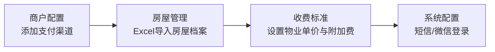

# 物业费收缴管理（Halo 插件）

> Halo 2.x 物业费收缴管理插件：房屋资料 Excel 批量导入、按小区/楼栋/房号在线查费、多商户号微信支付、线下缴费到账确认、缴费报表与收缴率看板。

适用于物业公司、业委会、单位宿舍等在 Halo 站点上搭建线上物业费收缴系统。业主在手机端选小区 → 楼栋 → 房号即可查费并缴费，管理员在后台管理房屋档案、收费标准与支付渠道。

## ✨ 功能特性

- 🏠 **房屋与业主档案**：小区/楼栋/单元/房号/面积/业主/租户信息管理，支持 Excel 批量导入，同小区同楼栋同房号自动更新不重复
- 💰 **收费标准引擎**：按小区+年份+物业类型（住宅/商铺/车位）差异化定价，支持按年/半年/季/月缴，附加费（电梯费/垃圾费/按面积/按月）、优惠减免（固定减/比例减/首年优惠）、滞纳金规则
- 💳 **支付渠道**：微信扫码（Native）/ 微信公众号（JSAPI）/ 线下转账；一个小区可绑多个渠道并设默认
- ✅ **线下缴费到账确认**：业主提交线下缴费申请后订单为「待核实到账」，必须由管理员在后台核对收款后手动确认，才会计入已缴；未确认不计入收缴率
- 📊 **缴费报表**：按小区/楼栋汇总收缴率、已收金额、缴费明细
- 📱 **移动端查费**：前台页面选房查费、微信内直接拉起支付、支付回调验签后自动入账
- 🔐 **安全**：敏感配置加密存储、接口不回传密钥明文；业主登录支持短信验证码与微信一键登录（令牌不经 URL 传递）
- 🔔 **重复缴费防护**：已缴年份自动拦截提示

> **功能范围**：本插件仅实现**微信支付**（Native / JSAPI）与**线下转账**两种收款方式，不包含支付宝渠道。

## 📸 界面

- 后台「物业费管理」：缴费报表 / 房屋档案 / 小区配置 / 收费标准 / 商户配置 / 系统配置 多页签管理
- 前台缴费页：选小区 → 楼栋 → 房号 → 查费 → 微信支付 / 线下缴费申请

## 📥 安装

1. 在 Halo 后台 **插件 → 安装**，上传 `property-fee-1.1.0.jar`（或从 Halo 应用市场直接安装）
2. 启用插件后，左侧菜单出现 **物业费管理**
3. 在「系统配置」页签配置短信（业主验证码登录）与微信（一键登录），或用「商户配置」添加支付渠道
4. 进入 **房屋管理** 页签，点击「Excel 导入」→ 下载模板 → 填写房屋档案上传

> 要求 Halo ≥ 2.23.0

## 🚀 使用说明

### 1. 初始化配置



1. **商户配置**：新增渠道 → 选「微信扫码 / 公众号 / 线下」，微信需填商户号、APIv3 密钥、商户私钥与证书序列号；线下填收款说明
2. **房屋管理**：下载 Excel 模板 → 填小区/楼栋/单元/房号/面积/业主/手机号等 → 上传导入
3. **收费标准**：选小区 → 填年份 → 物业单价（元/㎡·月）→ 附加费 → 优惠 → 保存
4. **系统配置**：配置业主登录方式（见第 4 节）

### 2. 前台缴费页地址与部署说明

插件内置前台缴费页，**随插件 jar 一起分发，无需另外部署静态文件**：

| 项目 | 说明 |
|---|---|
| 页面地址 | `https://你的域名/apis/api.propertyfee.halo.run/v1alpha1/pages/property-fee` |
| 短地址（可选） | 在站点 nginx 加一条 `location = /wuye { proxy_pass http://127.0.0.1:<Halo端口>/apis/api.propertyfee.halo.run/v1alpha1/pages/property-fee; }`，业主即可用 `https://你的域名/wuye` 访问 |
| 页面内接口 | 全部使用站点根路径的绝对地址（`/apis/...`），因此放在任何路径下都能正常工作 |
| 站点域名 | 页面不硬编码域名，按当前访问地址自动推导；如需固定可在「系统配置 → 前台缴费页 URL」填写 |
| 页面入口 | 后台「物业费管理」右上角提供「前台缴费页 ↗」按钮，直接跳转 |

> 微信内使用时建议站点启用 HTTPS，否则部分能力（如微信 JSAPI 支付）无法使用。

### 3. 前台缴费流程

1. 业主打开缴费页（见上节地址）
2. 依次选择 **小区 → 楼栋 → 房号 → 缴费年份**
3. 点击「查询物业费」→ 显示费用明细（物业费 + 附加费 - 优惠）
4. 选择支付方式：
   - **微信支付**：微信内自动拉起 JSAPI 支付；PC 端展示扫码支付
   - **线下转账**：按页面提示完成转账后提交申请 → 订单进入「待核实到账」
5. 后台 →「缴费报表 / 缴费记录」中，管理员对线下申请点击 **确认到账**（或 **驳回**）后才计入已缴
6. 后台「缴费报表」实时更新收缴率与已收金额

### 4. 业主登录方式（后台配置入口）

在 Halo 后台 **物业费管理 → 系统配置** 页签配置：

| 登录方式 | 需要配置 | 说明 |
|---|---|---|
| 手机验证码登录 | 短信开关 + 腾讯云 SecretId / SecretKey / SDKAppID / 短信签名 / 模板 ID | 未配置短信时**不提供**任何绕过方式，验证码无法登录 |
| 微信一键登录 | 微信开关 + 服务号 AppID / AppSecret / 授权回调域名 | 首次使用需绑定业主手机号（短信验证码校验），此后免密登录 |

> 密钥类配置保存后**不会再次回显明文**，界面只显示「是否已配置」；留空表示不修改，填 `-` 或直接提交空值表示清除。

### 5. Excel 模板字段

| 列 | 说明 | 必填 |
|---|---|---|
| 小区 | 小区名称（同小区同楼栋同房号自动更新） | ✅ |
| 楼栋 | 如 1 / 2 / 商业区 | ✅ |
| 单元 | 如 1 / 2（无单元可留空） | |
| 房号 | 如 101 / A01 | ✅ |
| 面积(㎡) | 数字 | ✅ |
| 业主姓名 | | |
| 手机号 | 业主缴费手机号 | |
| 身份证号 | 选填 | |
| 业主类型 | 业主/租户/亲属 | |
| 入住日期 | YYYY-MM-DD | |
| 房屋状态 | 自住/出租/空置/装修 | |
| 物业类型 | 住宅/商铺/车位/其他 | |

### 6. 微信支付配置说明

| 参数 | 获取位置 |
|---|---|
| 公众号 AppID | 微信公众平台（服务号） |
| 商户号 mch_id | 微信商户平台 |
| APIv3 密钥 | 商户平台 → API 安全 → APIv3 密钥 |
| 商户证书序列号 | 商户平台 → API 安全 → 证书管理 |
| 商户私钥 PEM | `apiclient_key.pem` 全文粘贴 |

> 回调地址默认自动生成：`https://你的域名/apis/api.propertyfee.halo.run/v1alpha1/feerecords/notify`，无需手工配置（微信商户平台需在「支付回调域名」中放行）。
> 回调处理遵循微信支付 APIv3 规范：先验签（平台证书）→ 再解密 → 核对商户号与订单金额后才入账。

### 7. 安全说明

- **业主身份**：验证码为安全随机数、5 分钟有效、同一手机号 60 秒限发一次、连续输错 5 次作废；短信通道未配置时不提供任何通用验证码或测试后门
- **登录令牌**：HMAC 签名，密钥每套安装随机生成并保存在服务器本地（权限 0600），不写入代码库、不通过接口返回；令牌有效期 7 天
- **微信登录**：使用一次性 `state` 防重放 + 回跳地址白名单；登录结果通过一次性票据在后台换取，令牌与手机号不出现在跳转 URL 中
- **业主资料**：匿名查费只返回房屋与费用信息，业主姓名 / 手机号仅在持有效令牌且为该房屋登记业主时返回
- **敏感配置**：商户私钥、APIv3 密钥、短信 SecretKey、公众号 AppSecret 均加密存储，接口只返回「是否已配置」，不支持通过 URL 传参提交配置
- **支付入账**：微信回调验签 + AES-GCM 解密 + 商户号 / 订单号 / 金额三重核对；线下缴费必须管理员确认到账

## ❓ FAQ

**Q：业主缴费时提示"该小区未配置可用支付渠道"？**
A：后台「商户配置」页签为该小区添加并启用至少一个渠道。

**Q：业主查费提示"该小区 xx 年收费标准未配置"？**
A：后台「收费标准」页签为该小区添加对应年份标准（含物业单价）。

**Q：Excel 导入提示"未解析到有效数据"？**
A：请下载模板后按模板列顺序填写（第 1 行为表头，勿改）；小区/楼栋/房号三列必填。

**Q：缴费后报表没更新？**
A：微信支付需商户平台正确配置回调域名，回调验签通过后自动入账；线下缴费需管理员在缴费记录中「确认到账」后才计入。

**Q：业主收不到验证码？**
A：请确认「系统配置」中已启用短信并填写完整的腾讯云短信参数；为保证安全，未配置短信时不会提供任何绕过登录的方式。

**Q：编辑保存报错？**
A：请升级插件至最新版本（≥1.1.0），旧版本存在乐观锁与鉴权问题。

## 🔧 开发调试

```bash
# 前端 UI
cd ui && pnpm install && pnpm dev

# 插件构建
./gradlew build

# 本地 Halo 运行调试
./gradlew haloServer
```

开发文档：<https://docs.halo.run/developer-guide/plugin/introduction>

## 🧩 相关项目

- [Halo 活动管理插件](https://github.com/chuanlbx-ui/halo-plugin-activity)（活动发布与报名）

## 📄 许可证

[GPL-3.0](LICENSE)
